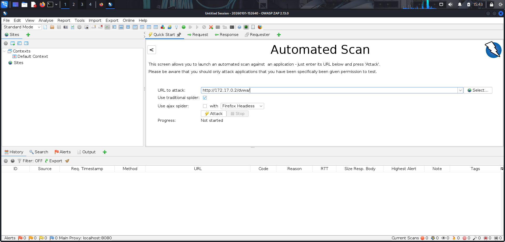
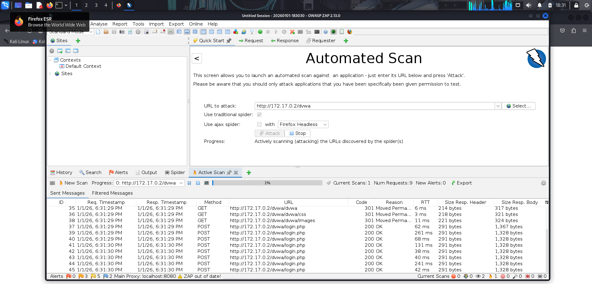
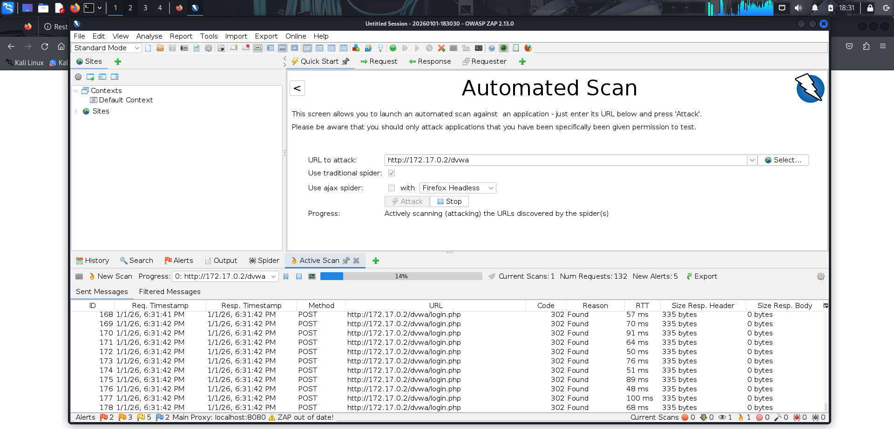
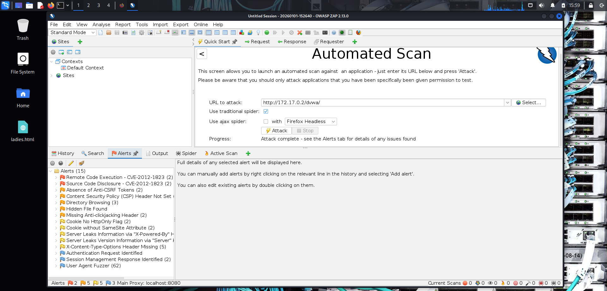

# 🔍 Web Application Vulnerability Scanning with OWASP ZAP


> Practical lab documentation covering web application vulnerability scanning using OWASP ZAP, completed as part of ParoCyber Ethical Hacking Training.

⚠️ **DISCLAIMER:** These techniques are for educational and authorized testing purposes only. Only scan applications you own or have explicit permission to test.

---

## 📋 Table of Contents

- [Objective](#-objective)
- [Tools Used](#-tools-used)
- [Lab Environment](#-lab-environment)
- [What is OWASP ZAP?](#-what-is-owasp-zap)
- [Scanning Workflow](#-scanning-workflow)
- [Scan Results](#-scan-results)
- [Vulnerability Analysis](#-vulnerability-analysis)
- [Remediation Recommendations](#-remediation-recommendations)
- [Key Learnings](#-key-learnings)
- [References](#-references)
- [Author](#-author)

---

## 🎯 Objective

The objectives of this lab are to:

1. **Understand web application security testing** using OWASP ZAP
2. **Perform automated vulnerability scanning** against a target application
3. **Analyze discovered vulnerabilities** and their risk levels
4. **Learn remediation strategies** for common web vulnerabilities
5. **Document findings** in a professional format

---

## 🛠️ Tools Used

| Tool | Version | Purpose |
|------|---------|---------|
| **OWASP ZAP** | v2.13.0 | Web application security scanner |
| **Kali Linux** | Latest | Attack platform |
| **DVWA** | Latest | Damn Vulnerable Web Application (target) |
| **Firefox** | Latest | Web browser for manual testing |

---

## 🖥️ Lab Environment

| Component | Details |
|-----------|---------|
| **Attacker Machine** | Kali Linux (VirtualBox) |
| **Target Application** | DVWA (Damn Vulnerable Web Application) |
| **Target URL** | http://172.17.0.2/dvwa/ |
| **Target Server** | Apache/2.2.8 (Ubuntu) DAV/2 |
| **PHP Version** | PHP/5.2.4-2ubuntu5.10 |
| **Scan Date** | January 01, 2026 |

---

## 📖 What is OWASP ZAP?

**OWASP ZAP (Zed Attack Proxy)** is a free, open-source web application security scanner maintained by the Open Web Application Security Project (OWASP).

### Key Features

- **Automated Scanner:** Discovers vulnerabilities automatically
- **Spidering:** Crawls applications to find all pages and endpoints
- **Active Scanning:** Tests for vulnerabilities by sending malicious payloads
- **Passive Scanning:** Analyzes responses without attacking
- **Fuzzing:** Tests inputs with unexpected data
- **API Testing:** Supports REST, SOAP, and GraphQL APIs
- **Reporting:** Generates detailed HTML/XML/JSON reports

### Why Use ZAP?

| Feature | Benefit |
|---------|---------|
| Free & Open Source | No licensing costs |
| Active Community | Regular updates and support |
| Cross-Platform | Windows, Linux, macOS |
| Extensible | 100+ add-ons available |
| CI/CD Integration | Automate security testing |

---

## 🔄 Scanning Workflow

### Step 1: Launch OWASP ZAP

```bash
zaproxy
# OR
owasp-zap
```

**Screenshot:**


---

### Step 2: Configure Automated Scan

1. Open ZAP and navigate to **Quick Start** tab
2. Select **Automated Scan**
3. Enter target URL: `http://172.17.0.2/dvwa/`
4. Enable **Use traditional spider** ✓
5. Click **Attack**


**Configuration:**
| Setting | Value |
|---------|-------|
| URL to attack | http://172.17.0.2/dvwa/ |
| Use traditional spider | ✓ Enabled |
| Use ajax spider | ☐ Disabled |

**Screenshot:**



---

### Step 3: Monitor Scan Progress

ZAP performs the following phases:
1. **Spider** — Crawls the application to discover pages
2. **Passive Scan** — Analyzes responses for issues
3. **Active Scan** — Tests for vulnerabilities with payloads

**Screenshot:**





---

### Step 4: Review Alerts

Once complete, navigate to the **Alerts** tab to view discovered vulnerabilities.

**Screenshot:**



---

## 📊 Scan Results

### Summary

| Severity | Count | Description |
|----------|-------|-------------|
| 🔴 **High** | 2 | Critical vulnerabilities requiring immediate attention |
| 🟠 **Medium** | 5 | Significant issues that should be addressed |
| 🟡 **Low** | 5 | Minor issues with limited impact |
| 🔵 **Informational** | 3 | Configuration notes and observations |
| **Total** | **15** | Unique vulnerability types discovered |

---

### Complete Findings List

#### 🔴 High Risk Vulnerabilities

| # | Vulnerability | Instances | CVE |
|---|---------------|-----------|-----|
| 1 | Remote Code Execution | 2 | CVE-2012-1823 |
| 2 | Source Code Disclosure | 2 | CVE-2012-1823 |

#### 🟠 Medium Risk Vulnerabilities

| # | Vulnerability | Instances |
|---|---------------|-----------|
| 3 | Absence of Anti-CSRF Tokens | 2 |
| 4 | Content Security Policy (CSP) Header Not Set | 4 |
| 5 | Directory Browsing | 3 |
| 6 | Hidden File Found | 1 |
| 7 | Missing Anti-clickjacking Header | 2 |

#### 🟡 Low Risk Vulnerabilities

| # | Vulnerability | Instances |
|---|---------------|-----------|
| 8 | Cookie No HttpOnly Flag | 2 |
| 9 | Cookie without SameSite Attribute | 2 |
| 10 | Server Leaks Information via "X-Powered-By" Header | 3 |
| 11 | Server Leaks Version Information via "Server" Header | 8 |
| 12 | X-Content-Type-Options Header Missing | 5 |

#### 🔵 Informational

| # | Finding | Instances |
|---|---------|-----------|
| 13 | Authentication Request Identified | 1 |
| 14 | Session Management Response Identified | 2 |
| 15 | User Agent Fuzzer | 62 |

---

## 🔬 Vulnerability Analysis

### 1. Remote Code Execution (CVE-2012-1823) 🔴 HIGH

**Risk Level:** High  
**Confidence:** Medium  
**CWE ID:** 20  
**WASC ID:** 20

**Affected URLs:**
```
POST: http://172.17.0.2/dvwa/?-d+allow_url_include%3d1+-d+auto_prepend_file%3dphp://input
POST: http://172.17.0.2/dvwa/login.php?-d+allow_url_include%3d1+-d+auto_prepend_file%3dphp://input
```

**Attack Payload:**
```php
<?php exec('echo 5msvgalhg6sefhxrxxqu',$colm);echo join(",$colm);die();?>
```

**Evidence:**
```
5msvgalhg6sefhxrxxqu
```

**Description:**
Some PHP versions, when configured to run using CGI, do not correctly handle query strings that lack an unescaped "=" character, enabling arbitrary code execution. In this case, an operating system command was caused to be executed on the web server, and the results were returned to the web browser.

**Impact:**
- Complete server compromise
- Data theft
- Malware installation
- Lateral movement in network

**Remediation:**
- Upgrade PHP immediately to version 5.3.12+ or 5.4.2+ (preferably PHP 8.x)
- Disable PHP-CGI if not required and use PHP-FPM instead
- Apply mod_rewrite rules to block malicious query strings containing dangerous characters
- Deploy a Web Application Firewall (WAF) to filter malicious requests
- Implement strict input validation to sanitize all user inputs
- Regularly patch and update all server software

**Screenshot:**


---

### 2. Source Code Disclosure (CVE-2012-1823) 🔴 HIGH

**Risk Level:** High  
**Confidence:** Medium

**Description:**
The same PHP-CGI vulnerability can be exploited to disclose source code of PHP files, revealing sensitive information like database credentials and application logic.

**Impact:**
- Exposure of sensitive configuration
- Database credentials leaked
- Business logic revealed

**Remediation:**
- Apply the same fixes as CVE-2012-1823 (upgrade PHP)
- Move sensitive configuration files outside the web root directory
- Use environment variables for storing sensitive data like database credentials
- Restrict access to sensitive files using server configuration
- Implement proper file permissions (read-only for web server user)
- Never store credentials or API keys in publicly accessible files

---

### 3. Absence of Anti-CSRF Tokens 🟠 MEDIUM

**Risk Level:** Medium  
**CWE ID:** 352

**Description:**
No Anti-CSRF tokens were found in HTML submission forms. This makes the application vulnerable to Cross-Site Request Forgery attacks.

**Impact:**
- Unauthorized actions on behalf of users
- Account takeover
- Data modification

**Remediation:**
- Implement CSRF tokens in all HTML forms that perform state-changing operations
- Generate unique, unpredictable tokens per session or per request
- Validate CSRF tokens on the server side before processing form submissions
- Use the SameSite cookie attribute set to "Strict" or "Lax"
- Validate Referer and Origin headers as an additional layer of protection
- Use framework-provided CSRF protection mechanisms when available
- Implement the double-submit cookie pattern for stateless applications

---

### 4. Content Security Policy (CSP) Header Not Set 🟠 MEDIUM

**Risk Level:** Medium  
**CWE ID:** 693

**Description:**
Content Security Policy (CSP) header is not set. CSP helps prevent XSS, clickjacking, and code injection attacks.

**Remediation:**
- Add Content-Security-Policy header in web server configuration (Apache, Nginx) or application code
- Start with a restrictive policy using "default-src 'self'" as the baseline
- Define specific directives for scripts, styles, images, fonts, and connections
- Use "frame-ancestors 'none'" to prevent clickjacking
- Restrict form actions to same-origin with "form-action 'self'"
- Start with report-only mode (Content-Security-Policy-Report-Only) to test before enforcing
- Monitor CSP violation reports to identify and fix issues
- Avoid using 'unsafe-inline' and 'unsafe-eval' whenever possible

---

### 5. Directory Browsing Enabled 🟠 MEDIUM

**Risk Level:** Medium  
**CWE ID:** 548

**Description:**
Directory listing is enabled, allowing attackers to view all files in directories.

**Evidence:**
```html
<title>Index of /dvwa/dvwa</title>
```

**Remediation:**
- Disable directory listing in Apache using "Options -Indexes" directive
- Disable autoindex in Nginx configuration
- Create default index files (index.html or index.php) in all directories
- Configure server to return 403 Forbidden for directory requests without index files
- Block access to sensitive directories entirely using server configuration
- Remove unnecessary files and directories from the web root
- Use proper access controls to restrict directory access

---

### 6. Missing Anti-clickjacking Header 🟠 MEDIUM

**Risk Level:** Medium  
**CWE ID:** 1021

**Description:**
The X-Frame-Options header is not set, making the application vulnerable to clickjacking attacks.

**Remediation:**
- Add X-Frame-Options header with value "DENY" to prevent all framing
- Use "SAMEORIGIN" value if same-origin framing is required
- Configure the header in web server (Apache, Nginx) or application code
- Use CSP frame-ancestors directive as a modern replacement ("frame-ancestors 'none'" or "frame-ancestors 'self'")
- Implement JavaScript frame-busting code as a legacy fallback for older browsers
- Apply the header to all responses, not just HTML pages

---

### 7. Cookie No HttpOnly Flag 🟡 LOW

**Risk Level:** Low  
**CWE ID:** 1004

**Description:**
Cookies are set without the HttpOnly flag, making them accessible to JavaScript and vulnerable to XSS-based theft.

**Affected Cookie:** PHPSESSID

**Remediation:**
- Enable the HttpOnly flag for all session cookies in PHP configuration (session.cookie_httponly = 1)
- Set HttpOnly flag programmatically when creating cookies in application code
- Configure web server to add HttpOnly flag to all Set-Cookie headers
- Combine HttpOnly with Secure flag to ensure cookies are only sent over HTTPS
- Also set the SameSite attribute for additional protection
- Verify cookie attributes using browser developer tools after implementation
- Review all custom cookies in the application and add HttpOnly where appropriate

---

### 8. Server Information Leakage 🟡 LOW

**Risk Level:** Low  
**CWE ID:** 200

**Leaked Headers:**
```
Server: Apache/2.2.8 (Ubuntu) DAV/2
X-Powered-By: PHP/5.2.4-2ubuntu5.10
```

**Impact:**
- Attackers can identify specific CVEs for these versions
- Targeted attacks become easier

**Remediation:**
- Configure Apache to hide version information using ServerTokens Prod and ServerSignature Off directives
- Disable PHP version exposure in php.ini by setting expose_php = Off
- Remove or modify the X-Powered-By header in application code
- Configure Nginx to hide server tokens using server_tokens off directive
- Use mod_security or similar WAF to modify or remove server identification headers
- Disable unnecessary modules that add identifying headers (info, status modules)
- Verify changes by inspecting response headers using curl or browser developer tools
- Keep all server software updated regardless of whether version is hidden

---

### 9. X-Content-Type-Options Header Missing 🟡 LOW

**Risk Level:** Low  
**CWE ID:** 693

**Description:**
The X-Content-Type-Options header is not set, allowing MIME-sniffing attacks.

**Remediation:**
- Add X-Content-Type-Options header with value "nosniff" in web server configuration
- Configure the header in Apache using Header always set directive
- Configure the header in Nginx using add_header directive
- Set the header in application code for dynamic responses
- Always specify correct Content-Type headers for all responses
- Apply this header alongside other security headers (X-Frame-Options, CSP, etc.)
- Ensure the header is sent with all responses, including error pages

---

### 10. Cookie without SameSite Attribute 🟡 LOW

**Risk Level:** Low  
**CWE ID:** 1275

**Description:**
Cookies are set without the SameSite attribute, making them vulnerable to Cross-Site Request Forgery (CSRF) attacks.

**Remediation:**
- Set SameSite attribute in PHP configuration (session.cookie_samesite = "Strict")
- Configure SameSite attribute programmatically when creating session cookies
- Apply SameSite attribute to all custom cookies in the application
- Use "Strict" value for maximum security (cookie only sent in first-party context)
- Use "Lax" value for balance between security and usability (sent with top-level navigations)
- Avoid "None" value unless absolutely necessary (requires Secure flag and HTTPS)
- Combine SameSite with HttpOnly and Secure flags for comprehensive cookie security

---

### 11. Hidden File Found 🟠 MEDIUM

**Risk Level:** Medium  
**CWE ID:** 538

**Description:**
Hidden files or backup files were discovered that may contain sensitive information.

**Remediation:**
- Block access to hidden files (files starting with ".") in web server configuration
- Block access to backup files with extensions like .bak, .backup, .old, .orig, .save, .swp, .tmp
- Configure server to return 403 Forbidden for requests to hidden or backup files
- Remove unnecessary files from production environment including backups and temporary files
- Delete .git, .svn, and other version control directories from web root
- Use .gitignore to prevent committing sensitive files to repositories
- Implement deployment processes that exclude development and backup files
- Regularly audit web directories for sensitive files that should not be publicly accessible

---

## 🛡️ Remediation Recommendations

### Priority Matrix

| Priority | Vulnerability | Effort | Impact |
|----------|---------------|--------|--------|
| 🔴 P1 | Remote Code Execution | High | Critical |
| 🔴 P1 | Source Code Disclosure | High | Critical |
| 🟠 P2 | CSRF Protection | Medium | High |
| 🟠 P2 | CSP Header | Low | Medium |
| 🟠 P2 | Directory Browsing | Low | Medium |
| 🟡 P3 | Cookie Flags | Low | Low |
| 🟡 P3 | Security Headers | Low | Low |

### Immediate Actions (P1)

1. **Upgrade PHP** to latest stable version
2. **Disable PHP-CGI** if not required
3. **Patch CVE-2012-1823** immediately

### Short-Term Actions (P2)

1. **Implement CSRF tokens** in all forms
2. **Add security headers:**
```apache
Header always set X-Frame-Options "DENY"
Header always set Content-Security-Policy "default-src 'self'"
Header always set X-Content-Type-Options "nosniff"
```
3. **Disable directory listing:**
```apache
Options -Indexes
```

### Long-Term Actions (P3)

1. **Configure secure cookies:**
```php
session_set_cookie_params([
    'httponly' => true,
    'secure' => true,
    'samesite' => 'Strict'
]);
```
2. **Hide server information**
3. **Implement Web Application Firewall (WAF)**
4. **Regular security scanning** in CI/CD pipeline

---

## 💡 Key Learnings

### What I Learned

1. **Automated scanning is powerful** — ZAP found 15 vulnerability types including a critical RCE in minutes.

2. **CVE-2012-1823 is devastating** — A single PHP misconfiguration can lead to complete server compromise.

3. **Security headers matter** — Missing headers like CSP, X-Frame-Options, and X-Content-Type-Options create multiple attack vectors.

4. **Information disclosure aids attackers** — Server version leakage helps attackers find specific exploits.

5. **Defense in depth is essential** — Multiple layers of security controls are needed.

### Real-World Impact

| Finding | Real-World Attack |
|---------|-------------------|
| RCE (CVE-2012-1823) | Attacker executes commands, installs backdoor |
| Source Code Disclosure | Attacker reads database credentials |
| Missing CSRF | Attacker tricks user into unauthorized actions |
| Directory Browsing | Attacker finds backup files, config files |
| Cookie without HttpOnly | XSS attack steals session cookies |

### Challenges Faced

1. **Understanding CVE details** — Had to research CVE-2012-1823 to understand the PHP-CGI vulnerability
2. **Prioritizing findings** — 15 different issues required careful triage
3. **Balancing security vs usability** — Some headers may break legacy functionality

---

---

## 📝 Lab Solutions

### Part 1: Investigate the WSTG

#### Question 1: What is the purpose of the OWASP Web Security Testing Guide?

**Answer:** It is designed to guide the testing of security of web applications. It describes techniques, methods, tools, and resources for testing for the most common web application security issues. It provides a framework of best practices.

---

#### Question 2: According to Mr. Keary, who is initially responsible for application security?

**Answer:** Developers

---

#### Question 3: Security testing should be included in which phase(s) of the Software Development Lifecycle (SDLC)?

**Answer:** All phases: Design, Development, Deployment, and Maintenance

---

#### Question 4: What three factors should be tested in an effective testing program?

**Answer:** People, Process, and Technology

---

#### Question 5: What four testing techniques are presented in the introduction of the OWASP Web Testing Guide?

| Technique | Definition |
|-----------|------------|
| **Manual inspections and reviews** | Human reviews that test security implications of all three factors of an effective testing program usually by inspecting documentation, secure coding policies, security requirements, architectural designs, and by interviewing designers and system owners. |
| **Threat modeling** | It is a technique to help designers think about the threats that their systems might face. In a sense it is risk assessment for applications. It enables identification of potential risk and implementation for mitigating those risks before exploits occur. |
| **Source code review** | This is the process of manually checking source code of web applications for insecure coding practices. |
| **Penetration testing** | Penetration testers access running web applications as if they were users to perform attacks and exploit vulnerabilities. It should not be the only technique used when testing application security. |

---

#### Question 6: According to the framework, what are the phases in which testing activities should take place?

**Answer:** Before development begins, during definition and design, during development, during deployment, during maintenance and operations.

---

### Part 2: Scan a Website and Investigate Vulnerability References

#### Question 7: How many alerts were returned?

**Answer:** Answers may vary, but the number should be around 13 when the scan has fully completed.

**My Results:** 15 alert types were discovered during my scan of DVWA (http://172.17.0.2/dvwa/):
- 🔴 2 High-risk alerts
- 🟠 5 Medium-risk alerts
- 🟡 5 Low-risk alerts
- 🔵 3 Informational alerts

---

#### Question 8: What is the source of this vulnerability? (CVE-2012-1823)

**Answer:** An out-of-date PHP version

**Details from my scan:**
- Server: Apache/2.2.8 (Ubuntu) DAV/2
- PHP Version: PHP/5.2.4-2ubuntu5.10
- The vulnerability exists in PHP versions before 5.3.12 and 5.4.x before 5.4.2

---

#### Question 9: How can this vulnerability be exploited?

**Answer:** PHP code can be injected into a PHP query string. This code will execute at the PHP exec.

**Evidence from my scan:**
```
Attack URL: http://172.17.0.2/dvwa/?-d+allow_url_include%3d1+-d+auto_prepend_file%3dphp://input

Payload: <?php exec('echo 5msvgalhg6sefhxrxxqu',$colm);echo join(",$colm);die();?>

Response: 5msvgalhg6sefhxrxxqu
```

The server executed the injected PHP code and returned the output, demonstrating successful remote code execution.

---

### Reflection Questions

#### Reflection 1: In what ways can the OWASP Web Security Testing Guide assist organizations to secure their applications?

**Answer:** The WSTG can assist organizations by helping them:
- Identify steps to build and operate a web application testing program
- Determine gaps between existing practices and industry best practices
- Ensure that software is coded securely and efficiently
- Make informed decisions about which security activities and tools to invest in

---

#### Reflection 2: When conducting a penetration test of a client's web applications, how could you use the WSTG as a guide?

**Answer:** The WSTG offers guidelines for 10 types of tests that could be conducted in penetration testing. Each type of test has a number of specific tests with explanations, instructions, and examples for using them, including lists of useful tools to employ.

**The 10 WSTG Testing Categories:**
1. Information Gathering
2. Configuration and Deployment Management Testing
3. Identity Management Testing
4. Authentication Testing
5. Authorization Testing
6. Session Management Testing
7. Input Validation Testing
8. Error Handling Testing
9. Cryptography Testing
10. Business Logic Testing
11. Client-side Testing

---

## 📚 References

- [OWASP ZAP Documentation](https://www.zaproxy.org/docs/)
- [OWASP Testing Guide](https://owasp.org/www-project-web-security-testing-guide/)
- [CVE-2012-1823 Details](https://nvd.nist.gov/vuln/detail/CVE-2012-1823)
- [OWASP Top 10](https://owasp.org/www-project-top-ten/)
- [CWE Database](https://cwe.mitre.org/)
- [Mozilla Security Headers](https://developer.mozilla.org/en-US/docs/Web/HTTP/Headers)

---

## 👤 Author

**Aliu Tijani**  
Ethical Hacking Student | ParoCyber Training Program

[](https://www.linkedin.com/in/aliutijani)
[](https://github.com/aliu2211)

---

## 📄 License

This project is licensed under the MIT License - see the [LICENSE](LICENSE) file for details.

---

*Created as part of ParoCyber Ethical Hacking Training — January 2026*
