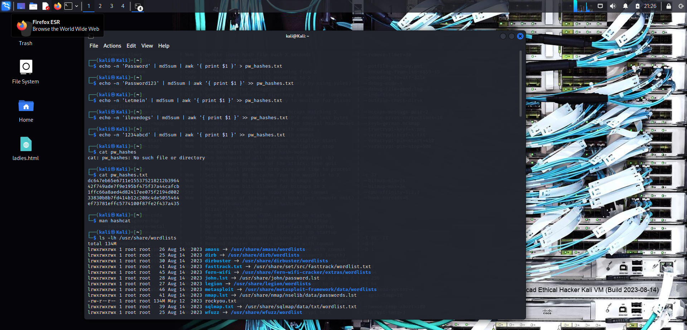
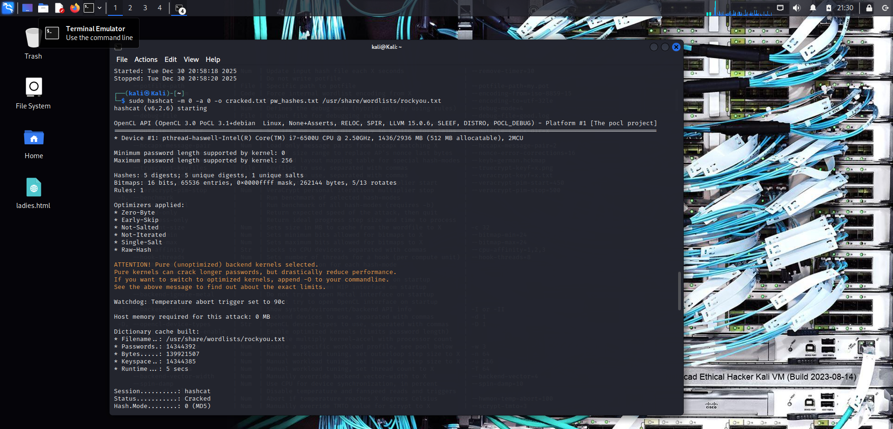
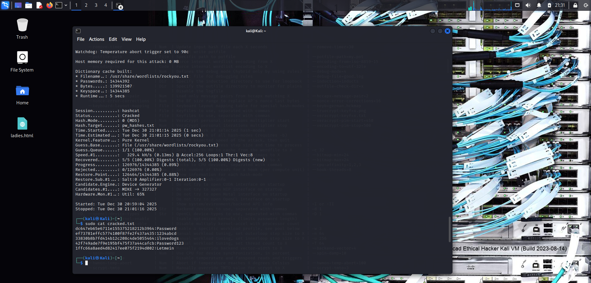

# 🔐 Password Cracking with Hashcat & John the Ripper


> Practical lab documentation covering password hash cracking using Hashcat and John the Ripper, completed as part of ParoCyber Ethical Hacking Training.

⚠️ **DISCLAIMER:** These techniques are for educational and authorized testing purposes only. Only crack passwords you have explicit permission to test.

---

## 📋 Table of Contents

- [Objective](#-objective)
- [Tools Used](#-tools-used)
- [Lab Environment](#-lab-environment)
- [Understanding Password Hashing](#-understanding-password-hashing)
- [Lab Setup](#-lab-setup)
- [Part 1: Cracking with Hashcat](#-part-1-cracking-with-hashcat)
- [Part 2: Cracking with John the Ripper](#-part-2-cracking-with-john-the-ripper)
- [Results Comparison](#-results-comparison)
- [Key Learnings](#-key-learnings)
- [Defensive Recommendations](#-defensive-recommendations)
- [References](#-references)
- [Author](#-author)

---

## 🎯 Objective

The objectives of this lab are to:

1. **Understand password hashing** and why it's used
2. **Create MD5 hashes** from plaintext passwords
3. **Perform dictionary attacks** using wordlists
4. **Compare Hashcat vs John the Ripper** performance and methodology
5. **Learn defensive measures** against password cracking

---

## 🛠️ Tools Used

| Tool | Version | Purpose |
|------|---------|---------|
| **Hashcat** | v6.2.6 | GPU-accelerated password cracker |
| **John the Ripper** | 1.9.0-jumbo-1 | CPU-based password cracker |
| **md5sum** | GNU coreutils | Generate MD5 hashes |
| **rockyou.txt** | 14.3M passwords | Dictionary wordlist |

---

## 🖥️ Lab Environment

| Component | Details |
|-----------|---------|
| **Operating System** | Kali Linux |
| **CPU** | Intel Core i7-6500U @ 2.50GHz |
| **Hash Type** | MD5 (Mode 0) |
| **Wordlist** | /usr/share/wordlists/rockyou.txt (134MB, 14.3M passwords) |
| **Target Hashes** | 5 MD5 password hashes |

---

## 📖 Understanding Password Hashing

### What is a Hash?

A **hash** is a one-way cryptographic function that converts plaintext into a fixed-length string. Key properties:

- **One-way:** Cannot be reversed mathematically
- **Deterministic:** Same input always produces same output
- **Fixed length:** Output size is constant regardless of input
- **Avalanche effect:** Small input change = completely different output

### Common Hash Types

| Algorithm | Length | Example | Security |
|-----------|--------|---------|----------|
| MD5 | 32 chars | `dc647eb65e6711e155375218212b3964` | ❌ Weak |
| SHA-1 | 40 chars | `5baa61e4c9b93f3f0682250b6cf8331b7ee68fd8` | ❌ Weak |
| SHA-256 | 64 chars | `5e884898da28047d9...` | ✅ Strong |
| bcrypt | 60 chars | `$2b$12$...` | ✅ Very Strong |

### Why MD5 is Insecure

- **Fast to compute:** Billions of hashes per second on modern GPUs
- **No salt:** Same password = same hash (rainbow table attacks)
- **Collision vulnerabilities:** Two inputs can produce same hash

---

## 🔧 Lab Setup

### Step 1: Create Test Passwords

We'll create 5 plaintext passwords and generate their MD5 hashes:

```bash
# Create hash file with 5 passwords
echo -n 'Password' | md5sum | awk '{ print $1 }' > pw_hashes.txt
echo -n 'Password123' | md5sum | awk '{ print $1 }' >> pw_hashes.txt
echo -n 'Letmein' | md5sum | awk '{ print $1 }' >> pw_hashes.txt
echo -n 'ilovedogs' | md5sum | awk '{ print $1 }' >> pw_hashes.txt
echo -n '1234abcd' | md5sum | awk '{ print $1 }' >> pw_hashes.txt
```

**Note:** The `-n` flag prevents echo from adding a newline character.

### Step 2: Verify Hash File

```bash
cat pw_hashes.txt
```

**Output:**
```
dc647eb65e6711e155375218212b3964
42f749ade7f9e195bf475f37a44cafcb
1ffc66a8aed4d82417ee075f2194d002
33830b8b7fd414b12c208c4de5055464
ef73781effc5774100f87fe2f437a435
```

### Password-to-Hash Mapping

| Password | MD5 Hash |
|----------|----------|
| Password | dc647eb65e6711e155375218212b3964 |
| Password123 | 42f749ade7f9e195bf475f37a44cafcb |
| Letmein | 1ffc66a8aed4d82417ee075f2194d002 |
| ilovedogs | 33830b8b7fd414b12c208c4de5055464 |
| 1234abcd | ef73781effc5774100f87fe2f437a435 |

### Step 3: Explore Available Wordlists

```bash
ls -lh /usr/share/wordlists
```

**Output:**
```
total 134M
lrwxrwxrwx 1 root root   26 Aug 14  2023 amass -> /usr/share/amass/wordlists
lrwxrwxrwx 1 root root   25 Aug 14  2023 dirb -> /usr/share/dirb/wordlists
lrwxrwxrwx 1 root root   30 Aug 14  2023 dirbuster -> /usr/share/dirbuster/wordlists
lrwxrwxrwx 1 root root   41 Aug 14  2023 fasttrack.txt -> /usr/share/set/src/fasttrack/wordlist.txt
lrwxrwxrwx 1 root root   28 Aug 14  2023 john.lst -> /usr/share/john/password.lst
-rw-r--r-- 1 root root 134M May 12  2023 rockyou.txt
lrwxrwxrwx 1 root root   39 Aug 14  2023 sqlmap.txt -> /usr/share/sqlmap/data/txt/wordlist.txt
```

**Screenshot:**




---

## 🔥 Part 1: Cracking with Hashcat

### What is Hashcat?

**Hashcat** is the world's fastest password recovery tool, supporting:
- 300+ hash types
- GPU acceleration (CUDA/OpenCL)
- Multiple attack modes (dictionary, brute-force, rule-based, hybrid)

### Key Hashcat Options

| Option | Description |
|--------|-------------|
| `-m 0` | Hash mode (0 = MD5) |
| `-a 0` | Attack mode (0 = dictionary) |
| `-o` | Output file for cracked passwords |
| `-O` | Optimized kernels (faster) |
| `--show` | Display cracked passwords |

### Running the Attack

```bash
sudo hashcat -m 0 -a 0 -o cracked.txt pw_hashes.txt /usr/share/wordlists/rockyou.txt
```

**Explanation:**
- `-m 0` — MD5 hash mode
- `-a 0` — Straight dictionary attack
- `-o cracked.txt` — Save cracked passwords to file
- `pw_hashes.txt` — Input hash file
- `/usr/share/wordlists/rockyou.txt` — Wordlist (14.3 million passwords)

### Hashcat Output

```
hashcat (v6.2.6) starting

OpenCL API (OpenCL 3.0 PoCL 3.1+debian  Linux, None+Asserts, RELOC, SPIR, LLVM 15.0.6, SLEEF, DISTRO, POCL_DEBUG) - Platform #1 [The pocl project]
==================================================================================================================================================
* Device #1: pthread-haswell-Intel(R) Core(TM) i7-6500U CPU @ 2.50GHz, 1436/2936 MB (512 MB allocatable), 2MCU

Hashes: 5 digests; 5 unique digests, 1 unique salts
Bitmaps: 16 bits, 65536 entries, 0x0000ffff mask, 262144 bytes, 5/13 rotates
Rules: 1

Dictionary cache built:
* Filename..: /usr/share/wordlists/rockyou.txt
* Passwords.: 14344392
* Bytes.....: 139921507
* Keyspace..: 14344385
* Runtime...: 5 secs

Session..........: hashcat
Status...........: Cracked
Hash.Mode........: 0 (MD5)
Hash.Target......: pw_hashes.txt
Time.Started.....: Tue Dec 30 21:01:14 2025 (1 sec)
Time.Estimated...: Tue Dec 30 21:01:15 2025 (0 secs)
Kernel.Feature...: Pure Kernel
Guess.Base.......: File (/usr/share/wordlists/rockyou.txt)
Guess.Queue......: 1/1 (100.00%)
Speed.#1.........:   329.4 kH/s (0.13ms) @ Accel:256 Loops:1 Thr:1 Vec:8
Recovered........: 5/5 (100.00%) Digests (total), 5/5 (100.00%) Digests (new)
Progress.........: 126976/14344385 (0.89%)
Rejected.........: 0/126976 (0.00%)
Restore.Point....: 126464/14344385 (0.88%)

Started: Tue Dec 30 20:59:04 2025
Stopped: Tue Dec 30 21:01:16 2025
```

**Screenshot:**




### View Cracked Passwords

```bash
sudo cat cracked.txt
```

**Output:**
```
dc647eb65e6711e155375218212b3964:Password
ef73781effc5774100f87fe2f437a435:1234abcd
33830b8b7fd414b12c208c4de5055464:ilovedogs
42f749ade7f9e195bf475f37a44cafcb:Password123
1ffc66a8aed4d82417ee075f2194d002:Letmein
```

**Screenshot:**



### Hashcat Results

| Status | Value |
|--------|-------|
| **Hashes Cracked** | 5/5 (100%) |
| **Speed** | 329.4 kH/s |
| **Progress** | 0.89% of wordlist |
| **Total Time** | ~2 minutes |

**Screenshot:**


---

## 🔓 Part 2: Cracking with John the Ripper

### What is John the Ripper?

**John the Ripper** (JtR) is a free, open-source password security auditing tool featuring:
- Multiple attack modes (single, wordlist, incremental)
- Auto-detection of hash types
- Support for many hash formats
- Built-in mangling rules

### Key John Options

| Option | Description |
|--------|-------------|
| `--format=` | Specify hash format |
| `--wordlist=` | Use dictionary attack |
| `--show` | Display cracked passwords |
| `--rules` | Enable word mangling rules |

### Running the Attack

#### Method 1: Default Mode (Auto-detection)

```bash
john --format=raw-md5 pw_hashes.txt
```

**Output:**
```
Using default input encoding: UTF-8
Loaded 5 password hashes with no different salts (Raw-MD5 [MD5 256/256 AVX2 8x3])
Warning: no OpenMP support for this hash type, consider --fork=2
Proceeding with single, rules:Single
Press 'q' or Ctrl-C to abort, almost any other key for status
Almost done: Processing the remaining buffered candidate passwords, if any.
Proceeding with wordlist:/usr/share/john/password.lst
Password         (?)     
Letmein          (?)     
Proceeding with incremental:ASCII
1234abcd         (?)     
3g 0:00:04:43  3/3 0.01058g/s 16684Kp/s 16684Kc/s 33469KC/s 8sLEB..8sL1S
```

**Cracked with default mode:** 3/5 passwords (Password, Letmein, 1234abcd)

#### Method 2: Wordlist Attack with rockyou.txt

```bash
john --wordlist=/usr/share/wordlists/rockyou.txt --format=raw-md5 pw_hashes.txt
```

**Output:**
```
Using default input encoding: UTF-8
Loaded 5 password hashes with no different salts (Raw-MD5 [MD5 256/256 AVX2 8x3])
Remaining 2 password hashes with no different salts
Warning: no OpenMP support for this hash type, consider --fork=2
Press 'q' or Ctrl-C to abort, almost any other key for status
ilovedogs        (?)     
Password123      (?)     
2g 0:00:00:00 DONE (2025-12-30 21:45) 14.28g/s 241371p/s 241371c/s 271542C/s coco21..redlips
Session completed. 
```

**Cracked remaining:** 2/2 passwords (ilovedogs, Password123)

### View All Cracked Passwords

```bash
john --show --format=raw-md5 pw_hashes.txt
```

**Output:**
```
?:Password
?:Letmein
?:1234abcd
?:ilovedogs
?:Password123

5 password hashes cracked, 0 left
```

### John the Ripper Results

| Status | Value |
|--------|-------|
| **Hashes Cracked** | 5/5 (100%) |
| **Speed** | 241,371 p/s (wordlist mode) |
| **Total Time** | ~5 minutes |

**Screenshot:**


---

## 📊 Results Comparison

### All Passwords Successfully Cracked

| Password | MD5 Hash | Hashcat | John |
|----------|----------|---------|------|
| Password | dc647eb65e6711e155375218212b3964 | ✅ | ✅ |
| Password123 | 42f749ade7f9e195bf475f37a44cafcb | ✅ | ✅ |
| Letmein | 1ffc66a8aed4d82417ee075f2194d002 | ✅ | ✅ |
| ilovedogs | 33830b8b7fd414b12c208c4de5055464 | ✅ | ✅ |
| 1234abcd | ef73781effc5774100f87fe2f437a435 | ✅ | ✅ |

### Tool Comparison

| Feature | Hashcat | John the Ripper |
|---------|---------|-----------------|
| **Speed** | 329.4 kH/s | 241.4 kH/s |
| **GPU Support** | ✅ Yes | ❌ Limited |
| **Attack Modes** | Many | Many |
| **Hash Types** | 300+ | 200+ |
| **Best For** | Speed (GPU) | Flexibility (CPU) |
| **Time to Crack** | ~2 min | ~5 min |

### Why These Passwords Were Easy to Crack

1. **Common passwords** — "Password", "Letmein" are in top 1000 most used
2. **Simple patterns** — "Password123" follows predictable pattern
3. **Dictionary words** — "ilovedogs" is a common phrase
4. **Short length** — "1234abcd" is only 8 characters
5. **MD5 is fast** — Allows billions of guesses per second

---

## 💡 Key Learnings

### What I Learned

1. **MD5 is dangerously fast** — 329,000 hashes per second on a basic CPU. GPUs can do billions.

2. **Dictionary attacks are effective** — All 5 passwords cracked by checking only 0.89% of rockyou.txt.

3. **Common passwords are instant** — "Password" and "Letmein" cracked in under a second.

4. **Multiple tools, same results** — Both Hashcat and John cracked everything, different approaches.

5. **Wordlists are powerful** — rockyou.txt (14.3M passwords) covers most real-world passwords.

### Real-World Implications

| Scenario | Risk |
|----------|------|
| **Data Breach** | Attackers crack MD5 hashes instantly |
| **Credential Stuffing** | Cracked passwords tried on other sites |
| **Privilege Escalation** | Admin passwords cracked from hash dumps |
| **Lateral Movement** | Reused passwords across systems |

---

## 🛡️ Defensive Recommendations

### For Users

| Recommendation | Why |
|----------------|-----|
| Use **long passwords** (16+ chars) | Exponentially harder to crack |
| Use **passphrases** | "correct-horse-battery-staple" > "P@ssw0rd!" |
| **Never reuse** passwords | One breach = all accounts compromised |
| Use a **password manager** | Generate and store unique passwords |
| Enable **MFA/2FA** | Password alone isn't enough |

### For Developers/Admins

| Recommendation | Why |
|----------------|-----|
| **Never use MD5** for passwords | Too fast, no salt |
| Use **bcrypt/Argon2** | Intentionally slow, includes salt |
| **Salt all hashes** | Prevents rainbow table attacks |
| Implement **rate limiting** | Slow down brute force attempts |
| **Monitor for breaches** | Check haveibeenpwned.com |

### Hash Algorithm Comparison

| Algorithm | Speed | Security | Use For Passwords? |
|-----------|-------|----------|-------------------|
| MD5 | Very Fast | ❌ Broken | ❌ Never |
| SHA-1 | Fast | ❌ Weak | ❌ No |
| SHA-256 | Fast | ✅ Strong | ❌ No (too fast) |
| bcrypt | Slow | ✅ Strong | ✅ Yes |
| Argon2 | Slow | ✅ Very Strong | ✅ Yes (recommended) |

---

## 📚 References

- [Hashcat Documentation](https://hashcat.net/wiki/)
- [John the Ripper Documentation](https://www.openwall.com/john/doc/)
- [OWASP Password Storage Cheat Sheet](https://cheatsheetseries.owasp.org/cheatsheets/Password_Storage_Cheat_Sheet.html)
- [Have I Been Pwned](https://haveibeenpwned.com/)
- [rockyou.txt Wordlist](https://github.com/brannondorsey/naive-hashcat/releases/download/data/rockyou.txt)

---

## 👤 Author

**Aliu Tijani**  
Ethical Hacking Student | ParoCyber Training Program

[](https://www.linkedin.com/in/aliutijani)
[](https://github.com/aliu2211)

---

## 📄 License

This project is licensed under the MIT License - see the [LICENSE](/LICENSE) file for details.

---

*Created as part of ParoCyber Ethical Hacking Training — January 2026*
